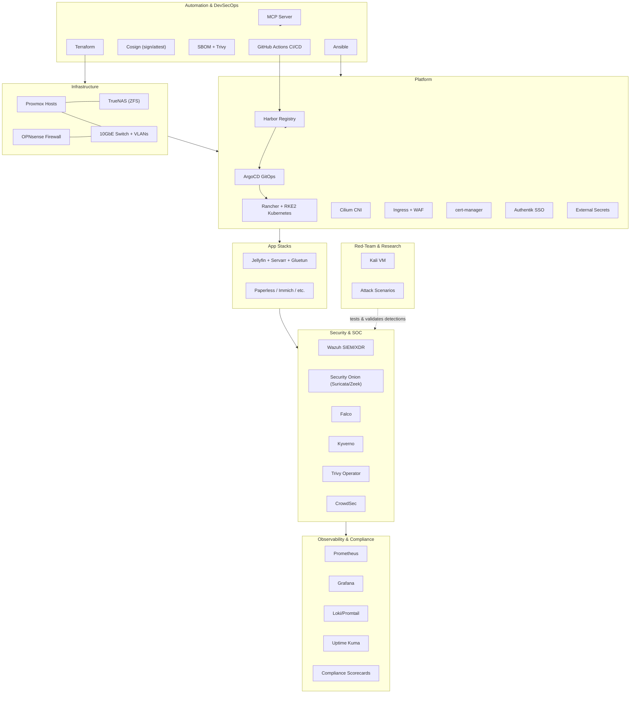

# Homelab — Portfolio of Stacks (Infra ▸ Platform ▸ Apps ▸ Security ▸ Observability ▸ Automation ▸ Research)

> A cohesive, production‑style homelab built from modular, open‑source stacks. This repo is the **landing page** linking to each stack, with a high‑level architecture and quick start.

---

## 🧭 High‑Level Architecture

---

## 📚 Repositories (Stacks)

> Replace `<your-username>` with your GitHub handle after you publish each repo.

- **Infrastructure & Virtualization** — Proxmox, TrueNAS (ZFS), OPNsense  
  `https://github.com/<your-username>/homelab-infrastructure-stack`
- **Platform (Kubernetes + GitOps + SSO)** — Rancher/RKE2, Cilium, Ingress WAF, cert-manager, Harbor, ArgoCD, Authentik, Kyverno, Falco, Trivy  
  `https://github.com/<your-username>/homelab-platform-stack`
- **Media Stack** — Jellyfin + Servarr + qBittorrent via Gluetun, Caddy + Authentik, optional extras  
  `https://github.com/<your-username>/homelab-media-stack`
- **Security & SOC** — Wazuh, Security Onion, Falco, CrowdSec, Kyverno, Trivy Operator  
  `https://github.com/<your-username>/homelab-security-soc-stack`
- **Observability & Compliance** — Prometheus/Grafana, Loki/Promtail, Uptime Kuma, scorecards  
  `https://github.com/<your-username>/homelab-observability-compliance-stack`
- **Automation & DevSecOps** — ArgoCD, Terraform, Ansible, CI/CD, Cosign, SBOM/Trivy, MCP  
  `https://github.com/<your-username>/homelab-automation-devsecops-stack`
- **Red‑Team & Research** — Kali VM cloud‑init, legal/ethics, scenarios  
  `https://github.com/<your-username>/homelab-redteam-research-stack`

---

## 🚀 How to Use This Portfolio

1. **Visit each stack** above for its README, setup, and docs.  
2. Start with **Infrastructure** → then **Platform** → then add **App Stacks**.  
3. Layer on **Security/SOC**, **Observability**, and **Automation** as you grow.  
4. The **Red‑Team** lab is isolated and used to validate detections + practice TTPs.

---

## 🛠️ What’s Included Here

- This repo is intentionally **docs‑only** (no code to run).  
- The purpose is to **tie your work together** and provide a single link you can put on your résumé/LinkedIn.

---

## 🧩 Topics / Tags to add on GitHub

`homelab`, `kubernetes`, `proxmox`, `truenas`, `opnsense`, `gitops`, `devsecops`, `security`, `observability`, `media-server`, `portfolio`

---

## 📌 Tips for Recruiters/Reviewers (TL;DR)

- Each stack is **self‑contained** and **reproducible**.  
- Security is **built‑in** (SSO, policies, signatures, scans).  
- Operations are **observable** (metrics, logs, uptime, compliance).  
- CI/CD and IaC keep everything **versioned** and **auditable**.

---

## 📝 License

MIT — see `LICENSE`.
